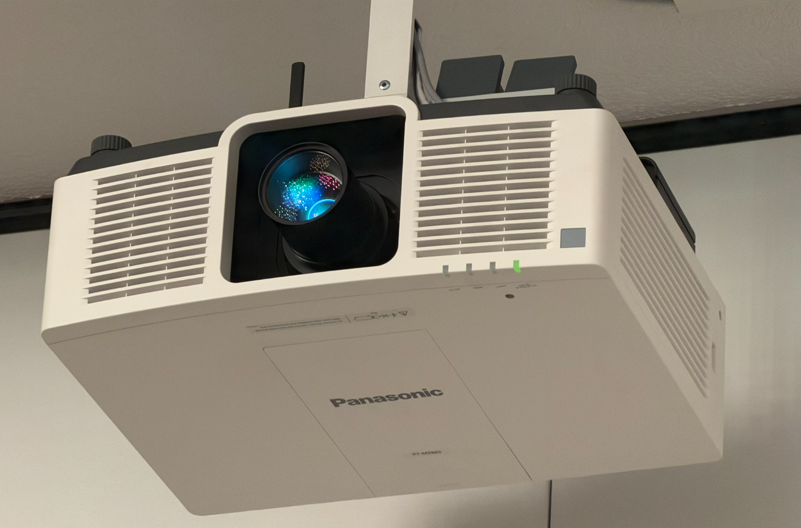
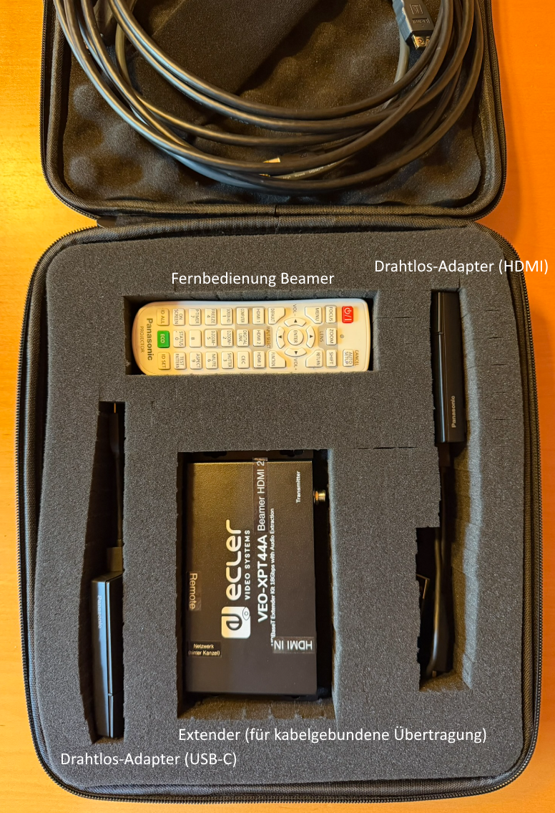
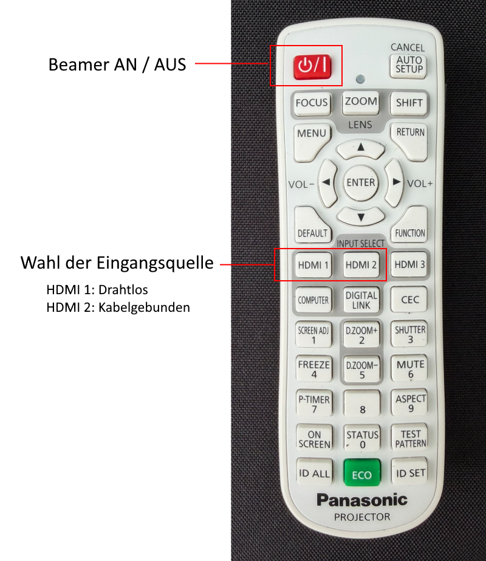
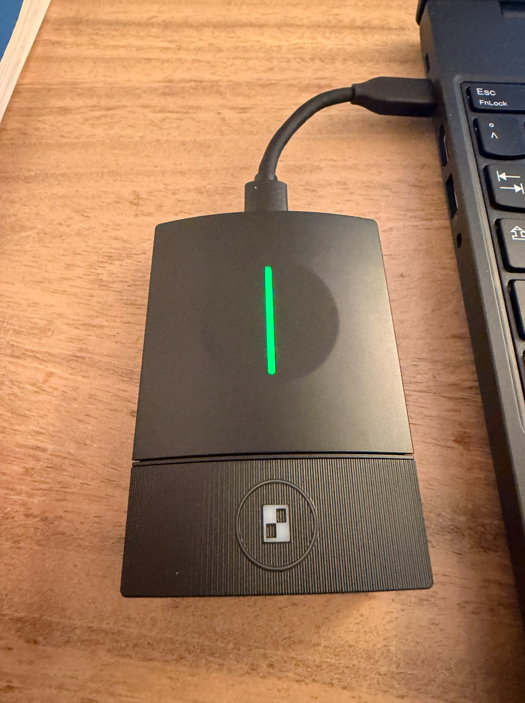
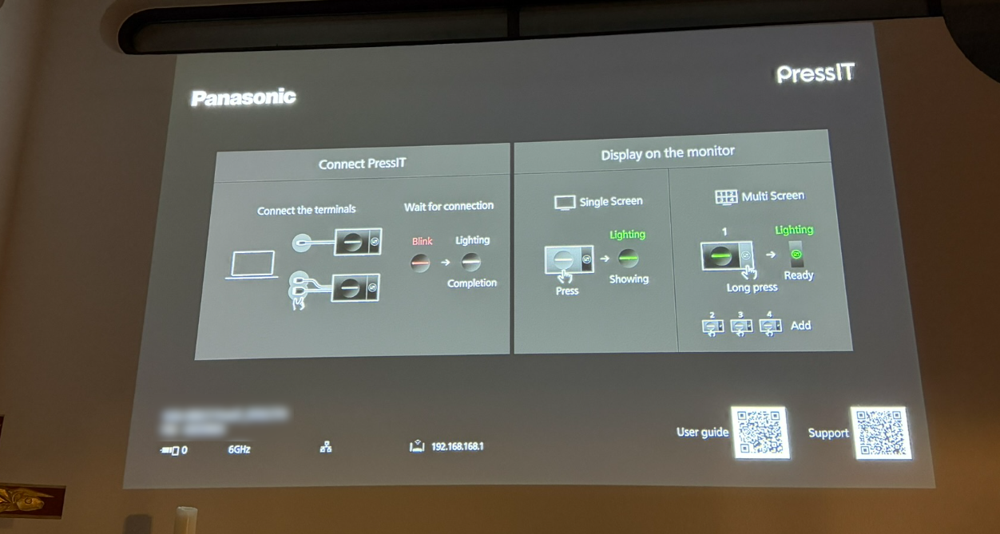
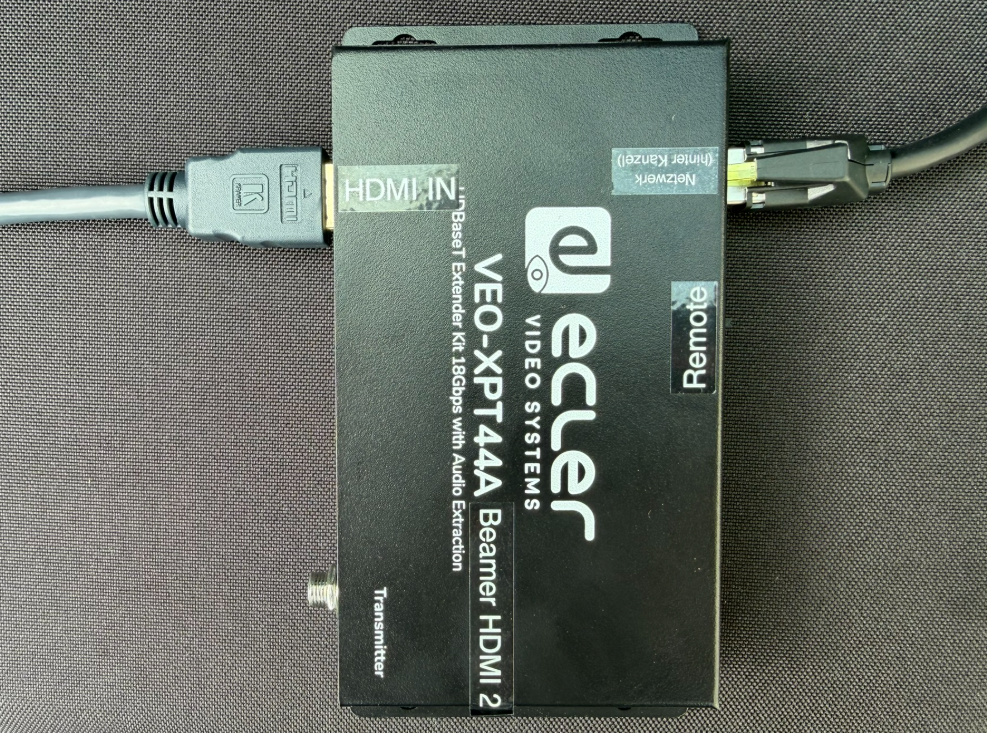
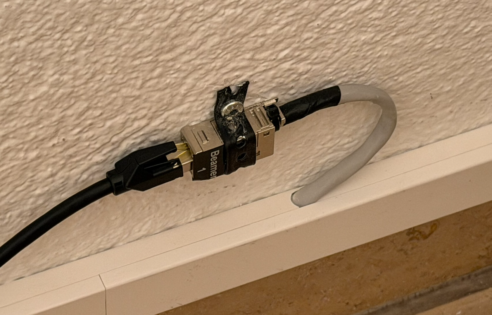
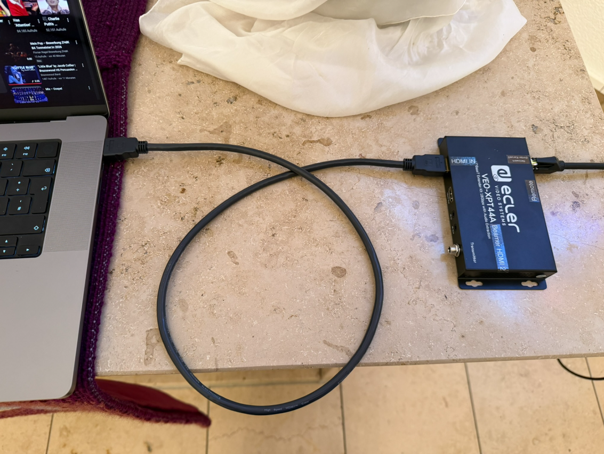

# Anleitung für den Beamer im Gottesdienstraum der Martin-Luther-Kirche
*Stand Juni 2026*

## Allgemein

  

Der Beamer ist fest an der Decke des Kirchenraumes installiert. Am Gerät selbst müssen keine Bedienschritte vorgenommen werden. Ein- und Ausschalten sowie die Auswahl des Eingangssignals erfolgt mittels Fernbedienung, die sich in einem schwarzen Koffer („Zubehör Beamer“) in der Schublade des „Lautsprecher-Schranks“ im Technikraum befindet.

  

  

Der Beamer wird über den roten Knopf eingeschaltet. Ausschalten geschieht ebenfalls über diesen Knopf (**zweimal** drücken). Sollte der Beamer nicht reagieren, bitte darauf achten, mit der Fernbedienung auf den Beamer zu zielen - nicht auf die Projektionsfläche.

## Drahtlose Verbindung

In dem Koffer befinden sich auch zwei Drahtlos-Adapter zum Anschluss von Notebooks. Für aktuelle Notebooks kann der USB-C-Adapter (links im Koffer) verwendet werden. Für ältere Modelle ohne USB-C-Anschluss steht ein HDMI-Adapter bereit (rechts im Koffer). Bitte bei diesem Adapter darauf achten, dass auch das zweite Kabel (mit USB-A-Stecker) zur Stromversorgung im Notebook eingesteckt wird. Ansonsten funktioniert die Verbindung nicht.

  

Ist der Drahtlos-Adapter korrekt im Notebook eingesteckt, blinkt dieser für einige Sekunden **rot**. Bitte warten, bis der Streifen **weiß** leuchtet. Dann auf den Streifen klicken / drücken. Die Farbe wechselt zu **grün** und der Bildschirminhalt des Notebooks wird auf den Beamer übertragen. Ein erneutes Klicken auf den Streifen beendet die Übertragung und die Farbe wechselt zurück zu **weiß**.

Ist der Beamer auf die richtige Eingangsquelle konfiguriert, zeigt er, bis der Drahtlos-Adapter verbunden ist, eine Kurzanleitung an:

  

### Problembehebung

Projiziert der Beamer trotz grünen Lichts den Bildschirminhalt nicht, über die Fernbedienung des Beamers die Eingangsquelle **HDMI1** auswählen. Oder ist der Beamer noch ausgeschaltet?

## Übertragung des Notebook-Tons

Der Notebook-Ton kann direkt in die Soundanlage der Kirche übertragen werden. Je nach Betriebssystem-Version ist die Bedienung hierzu leicht unterschiedlich. Prinzipiell muss aber über das Lautsprecher-Icon (meist rechts unten) die Soundausgabe festgelegt werden. Hier steht im Normalfall die eingebauten Lautsprecher und der Beamer zur Auswahl.

### Problembehebung

|Problem     | Lösungen                                         |
|-------     |---                                               |
|Ton zu leise|* Am Notebook die Lautstärke erhöhen              |
|            |* Am Bedienpult der Lautsprecheranlage (Mesnerplatz) *Kanal 2* lauter regeln. |
|Kein Ton | * Ist die Lautsprecher-Anlage eingeschaltet?        |
|         | * StageBox hinter der Kanzel kontrollieren: Ist der mit **BEAMER** beschriftete Stecker in der Buchse **2** eingesteckt |

## Kabelverbindung

Als Alternative zur kabellosen Übertragung besteht auch die Möglichkeit, das Signal via HDMI-Kabel an den Beamer zu senden. Dies ist vor allem dann sinnvoll, wenn die Signalquelle außer dem HDMI-Ausgang keinen USB-A-Buchse hat, um den drahtlosen Adapter mit Strom zu versorgen. Dies wäre zum Beispiel bei einem Bluray-Player der Fall.

Für diese Verbindungsart wird der Extender (schwarzer Kästchen in der Mitte des Koffers) und zwei Kabel benötigt (beide im Deckel des Koffers).

Das HDMI-Kabel verbindet die Signalquelle mit dem Extender und das Netzwerk-Kabel den Extender mit der Netzwerkbuchse hinter der Kanzel.

**WICHTIG:** Für diesen Modus muss der Beamer auf den Eingang **HDMI 2** eingestellt werden. Dazu bitte die Fernbedienung verwenden.

### Verkabelung Extender

  

### Netzwerkbuchse hinter der Kanzel

  

### Beispielverkabelung

  

## Fragen?

Bei Fragen oder Problemen gerne bei Christian Polonio melden.

